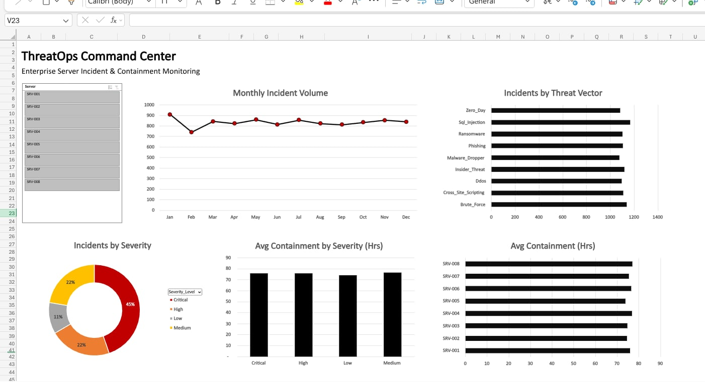

# 🛡️ SOC Cyber Threat Analytics

## 📝 Business Scenario
The Security Operations Center (SOC) provided a raw dump of 10,000 cyber incident logs. The objective was to clean the raw data, map the threat identifiers to their corresponding severity levels using lookup tables, and build an interactive front-end dashboard to track attack vectors and volume.

## 🏗️ Architecture & Methodology
This project strictly adheres to the **3-Tab Architecture** to separate raw data from business logic and the presentation layer:

1. **Row_Logs (The Vault):** The raw, untouched `cyber_incidents_raw.csv` dataset along with the `threat_matrix` and `server_nodes` lookup tables.
2. **Clean_Data (The Core):** 
   - Parsed timestamps and generated date helper columns.
   - Deployed `XLOOKUP` / `INDEX+MATCH` to bridge the primary keys across the lookup tables, retrieving `Severity_Level` and `Breach_Status`.
   - Handled ghost blank traps and executed data normalization.
3. **Dashboard_Engine & Dashboard (The UI):** 
   - Built an aggregation engine using Pivot Tables counting the primary key (`Incident_ID`).
   - Designed a Web-friendly UI adhering to the **F-Pattern** and Gestalt Common Regions.
   - Maximized the Data-Ink Ratio by stripping gridlines, legends, and redundant axis labels.

## 📊 Dashboard Preview

