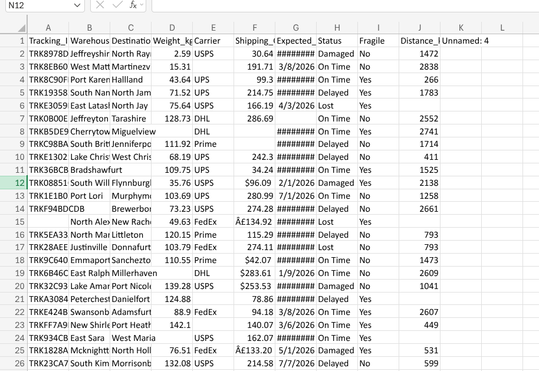
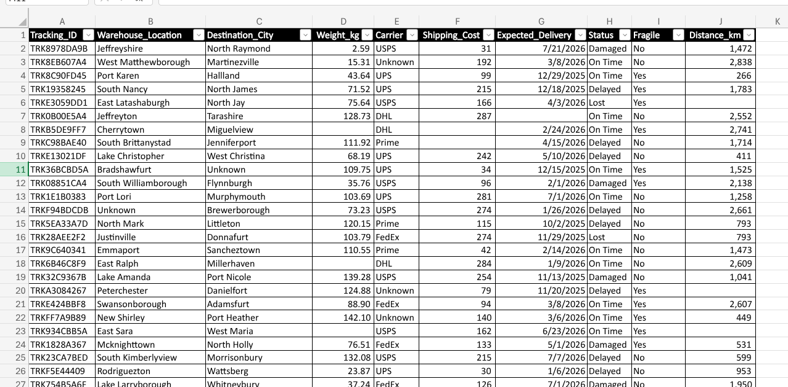

# 🧹 Logistics Data

## 🏗️ Cleaning Architecture
To maintain a strict separation of concerns, the data pipeline is divided into two distinct states:
* **Raw_Data:** The untouched shipment records. This raw dump contains corrupted currency encodings, inconsistent numeric formats, missing categorical values, and unformatted datetimes.
* **Clean_Data:** The sanitized dataset. Data types have been strictly enforced, null categorical gaps have been safely filled, and temporal fields are preserved for accurate chronological sorting.

## 🛠️ Transformation Methodology
The following standardizations were applied to convert the raw logs into an analysis-ready state:

* **Text-to-Numeric Casting:** Raw `Shipping_Cost` values contained mixed character corruptions (e.g., `£` and `$`) forced into strings. These were stripped and converted to pure numerical values to support mathematical aggregation.
* **Categorical Integrity:** Addressed blank cells in text attributes (`Carrier`, `Warehouse_Location`, `Destination_City`, and `Status`) using standardized markers (`Unknown` and `Pending`). This was executed via batch in-place filling to eliminate null gaps without formula bloat.
* **Date Hierarchy Preservation:** Formatted `Expected_Delivery` as `Short Date`. Empty date cells were strictly preserved as true nulls (avoiding text placeholders like "Unknown") to protect automated date grouping and chronological timelines.
* **Precision Formatting:** Applied standard thousand separators (`#,##0`) to `Distance_km` while retaining two-decimal precision (`#,##0.00`) on `Weight_kg` to prevent rounding errors during unit-cost calculations.

## 📊 Transformation Preview
Raw Data (Before)

Cleaned Data (After)

